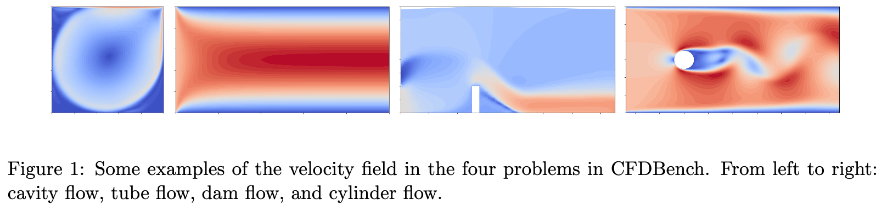
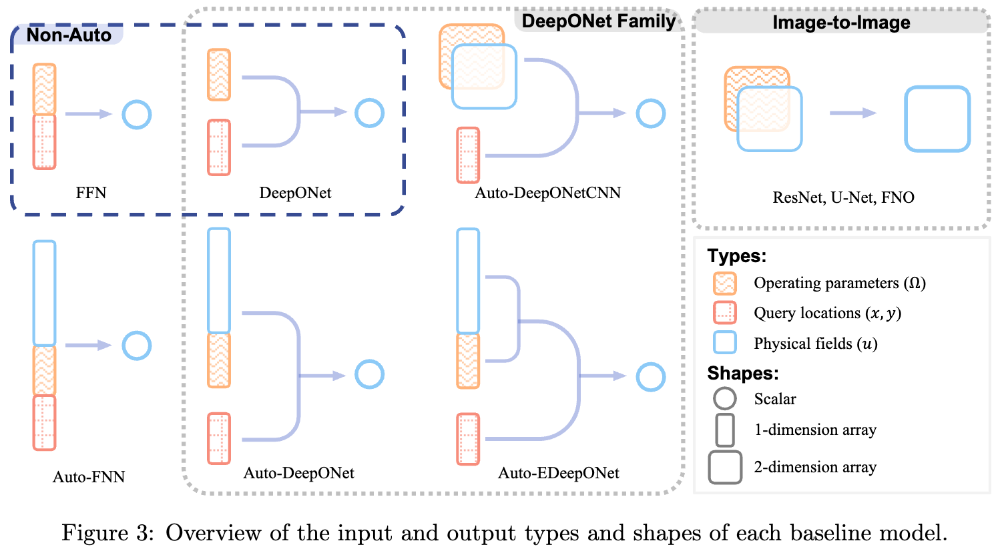
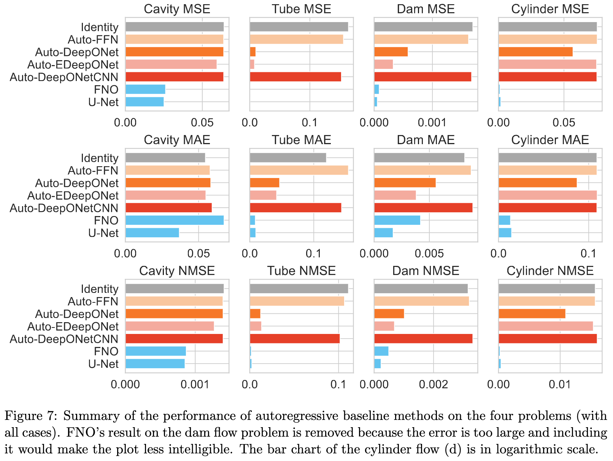

[Code](https://www.github.com/luo-yining/CFDBench) | [Paper](https://arxiv.org/abs/2310.05963) | [Paper (preprints.org)](https://www.preprints.org/manuscript/202309.1550/v1) | [知乎](https://zhuanlan.zhihu.com/p/656033757)

I did this work with my girlfriend, whose research direction is computational fluid dynamics (CFD). We observed that there are numerous research works in applying deep learning (DL) to solve CFD problems. E.g., [Pangu-Weather](https://github.com/198808xc/Pangu-Weather) have shown that DL methods can not only be more accurate than the best numerical methods, but can also be multiple magnitudes faster.

<!-- more -->

However, there is no standard benchmark for evaluating the performance of different DL methods. Therefore, we constructed CFDBench.

---

## Abstract

In recent years, applying deep learning to solve physics problems has attracted much attention. Data-driven deep learning methods produce fast numerical operators that can learn approximate solutions to the whole system of partial differential equations (i.e., surrogate modeling). Although these neural networks may have lower accuracy than traditional numerical methods, they, once trained, are orders of magnitude faster at inference. Hence, one crucial feature is that these operators can generalize to unseen PDE parameters without expensive re-training. In this paper, we construct CFDBench, a benchmark tailored for evaluating the generalization ability of neural operators after training in computational fluid dynamics (CFD) problems. It features four classic CFD problems: lid-driven cavity flow, laminar boundary layer flow in circular tubes, dam flows through the steps, and periodic Karman vortex street. The data contains a total of 302K frames of velocity and pressure fields, involving 739 cases with different operating condition parameters, generated with numerical methods. We evaluate the effectiveness of popular neural operators including feed-forward networks, DeepONet, FNO, U-Net, etc. on CFDBnech by predicting flows with non-periodic boundary conditions, fluid properties, and flow domain shapes that are not seen during training. Appropriate modifications were made to apply popular deep neural networks to CFDBench and enable the accommodation of more changing inputs. Empirical results on CFDBench show many baseline models have errors as high as 300% in some problems, and severe error accumulation when performing autoregressive inference. CFDBench facilitates a more comprehensive comparison between different neural operators for CFD compared to existing benchmarks.

