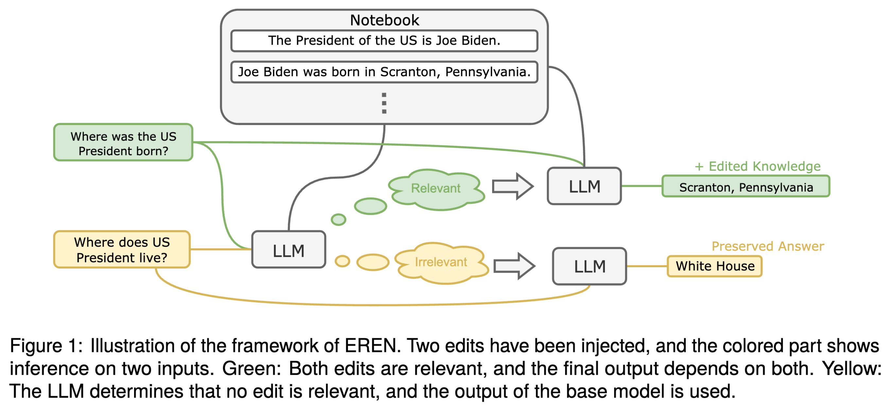
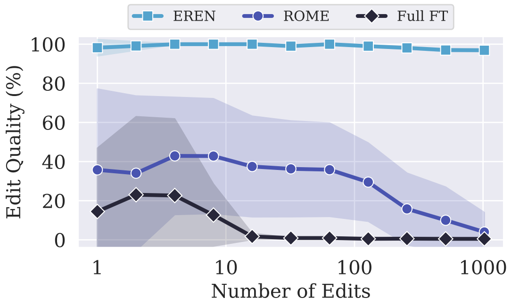

[GitHub](https://www.github.com/chen-yingfa/eren) | [Paper (upcoming)](...)

**TL;DR**: A reader is augmented with a growing notebook that caches all edits in natural texts, and the reader retrieves relevant edits and make inference based on them. This achieves SOTA in model editing in QA and fact-checking.

<!-- more -->

> NB: The COLING template in 2024 was very ugly.

---

## Introduction

This work introduces a model editing method that addresses two issues with existing model editors:
1. They cannot handle multiple sequential edits.
2. They cannot be applied to black-box models.

> The reason we want to apply multiple sequential edits is that in practical applications, new knowledge appear in an on-line manner and the user might want to update the model's knowledge immediately.

## Method

In summary, the edited LLM is complemented with a notebook that caches all edits in natural text. For each question, the model first determines whether the input is relevant to any edit, if so, it makes a prediction based on the notebook. Else, it directly answers the question using its memorized knowledge.

We find that LLMs, even when instruction-tuned, are not readily controllable by their context, i.e. the notebook. In particular, they are not robust to irrelevant context^[which has been concluded in several previous works], resulting in changed predictions on unrelated inputs. Also, the number of edits may to too large to fit into the input context of the LLM. Addressing these two issues, we propose to (1) split inference into two steps, and (2) use a dual-encoder retrieval framework to perform rough relevance estimation. Figure 1 (above) shows the overall framework of our method.^[For more details, please read the paper or contact me through e-mail.]

## Result

From the following results on CounterFact (QA editing task) and FEVER (fact-checking editing task), we conclude that our LLM editor significantly outperforms existing methods.

### Metrics

- ES (Edit Success): the percentage of examples where the model correctly answers the question after the edit.
- BP (Behavior Preservation): the percentage of unrelated examples whose output were not changed by the edit.
- EQ (Edit Quality): the harmonic mean of ES and BP.^[Using harmonic mean because we want the model editor to have both high ES and BP. A naive editor that ignores all edits can have a BP of 1, but ES of 0.]

A perfect model editor should have an EQ of 1.

The reason MEND and ROME performs so bad is that after many **sequential** edits, the model parameters are changed to much that the models start to output unintelligible tokens. In the case of fact-checking, randomly guessing "yes" or "no" should result in a 50% accuracy. However, since we use exact match to compute the accuracy, both MEND and ROME have much lower accuracy than random guess.

### Different Number of Edits

For methods that modify the model parameters, each edit will have detrimental effects on the model's performance. Moreover, for methods like ROME that depend on precomputing layer statistic of the unedited model, that statistics will be gradually more inaccurate after every edit (recomputing that statistics is too costly). Therefore, after many sequential edits, the model will start to spit out gibberish, as evident in the Figure below.

