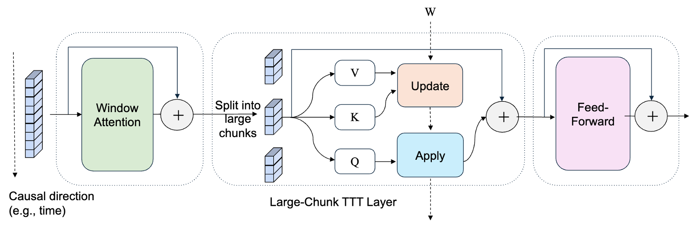

**Abstract**:

The main idea in test-time training (TTT) ([Sun et al. 2024](https://arxiv.org/pdf/2407.04620)) is that a model with fixed parameters produces the supervision for another network that is updated during test-time (or inference-time). This article first reviews the TTT paper. Then, we discuss the problem with TTT and how LaCT addresses them, resulting in a powerful attention alternative that balances efficiency and performance.

<!-- more -->

> Currently, "test-time training" is an overloaded term with multiple meanings. In this article, we use the term to refer to the test-time training paradigm proposed in [Sun et al. 2024](https://arxiv.org/pdf/2407.04620), which is a framework for recurrent architectures for sequence modeling.

# Background

We start by formulating vanilla attention ([Vaswani et al. 2017](https://arxiv.org/abs/1706.03762)) and linear attention ([Katharopoulos et al. 2020](https://arxiv.org/abs/2006.16236)), which helps us set up the notations. It also allows us to better understand the TTT architecture by comparing it to attention variants.

## Attention

To unify the notation, we formulate the popular attention mechanism as follows:

$$
\begin{align*}
\mathbf q_t &= \mathbf x_t \mathbf W_q \in \mathbb R ^d \\
\mathbf k_t &= \mathbf x_t \mathbf W_k \in \mathbb R ^d \\
\mathbf v_t &= \mathbf x_t \mathbf W_v \in \mathbb R ^d \\
\mathbf o_t &= \text{softmax}\left(\frac{\mathbf q_t \mathbf K_t^T}{\sqrt{d}}\right) \mathbf V_t \in \mathbb R ^d
\end{align*}
$$

where $\mathbf x_t \in \mathbb R ^{d_h}$ is the input at time $t$, $d$ is the head size, $\mathbf W_q, \mathbf W_k,\mathbf W_v \in \mathbb R^{d_h \times d}$ are the query, key, and value projection matrices, respectively. $\mathbb K_t, \mathbb V_t \in \mathbb R ^{t \times d}$ are called the *KV cache*, which are the concatenation of all keys and values seen so far:

$$
\mathbf K_t = \begin{bmatrix}
\mathbf k_1 \\
\vdots \\
\mathbf k_t
\end{bmatrix}, \mathbf V_t = \begin{bmatrix}
\mathbf v_1 \\
\vdots \\
\mathbf v_t
\end{bmatrix} \in \mathbb R ^{t \times d}
$$

And the output at each time step is:

> We are omitting the $\sqrt{d}$ denominator from here on for simplicity and because it can be absorbed into the query or key matrices.

$$
\mathbf y_t = \text{softmax}\left(\mathbf q_t \mathbf K_t^T \right) \mathbf V_t \in \mathbb R ^d
$$

## Linear Attention

We formulate linear attention here as it has become a popular and competitive RNN variant, and it is fairly easy to understand.

In linear attention ([Katharopoulos et al. 2020](https://arxiv.org/abs/2006.16236)), we remove the softmax function from attention:

$$
\begin{align*}
\mathbf y_t &= \cancel{\text{softmax}}\left(\mathbf q_t \mathbf K_t^T \right) \mathbf V_t \\
\rightarrow \mathbf y_t &= \left(\mathbf q_t \mathbf K_t^T \right) \mathbf V_t \\
&= \mathbf q_t \left(\mathbf K_t^T \mathbf V_t \right) \\
&= \mathbf q_t \underbrace{\sum_{i=1}^N \mathbf k_i^T \mathbf v_i}_{\text{sum of outer products}} \\
\end{align*}
$$

This can be written as a recurrent equation:

$$
\begin{align*}
\mathbf S_t &= \mathbf S_{t-1} + \mathbf k_t^T \mathbf v_t \in\mathbb R^{d\times d} & \text{(Update rule)} \\
\mathbf y_t &= \mathbf q_t \mathbf S_t \in \mathbb R ^d & \text{(Query rule)} \\
\end{align*}
$$

# Test-Time Training

In test-time training (TTT), the recurrent state is replaced with a neural network $f(\cdot, \mathbf W_t)$, parameterized by $\mathbf W_t$, which we call the *fast weight*. The following table summarizes the update and query rules of different attention variants and DeltaNet ([Schlag et al. 2021](https://arxiv.org/abs/2102.11174)) and TTT, which are two popular RNN variants. We will soon see that both linear attention and DeltaNet are special cases of TTT.

| Model | Update Rule | Query Rule | State Size |
| --- | --- | --- | --- |
| Attention | $\mathbf K_t\text{.append}(\mathbf k_t)$ $\mathbf V_t\text{.append}(\mathbf v_t)$ | $\mathbf y_t = \text{softmax}\left(\mathbf q_t \mathbf K_t^T \right) \mathbf V_t$ | $2 td$ |
| Linear Attention | $\mathbf S_t = \mathbf S_{t-1} + \mathbf k_t^T \mathbf v_t$ | $\mathbf y_t = \mathbf q_t \mathbf S_t$ | $d^2$ |
| DeltaNet | $\mathbf S_t = \mathbf S_{t-1} - \beta \mathbf k_t^T(\mathbf k_t\mathbf S_{t-1} - \mathbf v_t)$ | $\mathbf y_t = \mathbf q_t \mathbf S_t$ | $d^2$ |
| TTT | $\mathbf W_t= \mathbf W_{t-1} - \eta_t \nabla_{\mathbf W_{t-1}} \mathcal L$ | $\mathbf y_t = f(\mathbf q_t, \mathbf W_t)$ | Arbitrary |

## Test-Time Training Update Rule

TTT is trained with a self-supervised *reconstruction loss*:
$$
\mathcal L(\mathbf k_t, \mathbf v_t, \mathbf W_{t-1}) = \left\lVert f(\mathbf k_t, \mathbf W_{t-1}) - \mathbf v_t \right\rVert_2^2
$$

The main principle behind TTT is that the fast weights is an *associative memory* that reconstructs $\mathbf v_t$ from $\mathbf k_t$.

**Example 1 - Linear Attention**:

Consider the simplest case where the fast weight is a linear model (i.e., $f(\mathbf k_t, \mathbf W_{t-1}) = \mathbf k_t \mathbf W_{t-1}$) and the loss function is the negative dot product of $\mathbf v_t$ and the reconstructed value $f(\mathbf k_t, \mathbf W_{t-1})$:

$$
\begin{align*}
f(\mathbf k_t, \mathbf W_{t-1}) &= \mathbf k_t \mathbf W_{t-1} \\
\mathcal L(\mathbf k_t, \mathbf v_t, \mathbf W_{t-1}) &= -\mathbf k_t \mathbf W_{t-1} \mathbf v_t^T \\
\Rightarrow \nabla_{\mathbf W_{t-1}} \mathcal L(\mathbf k_t, \mathbf v_t, \mathbf W_{t-1}) &= -\mathbf k_t^T \mathbf v_t \\
\Rightarrow \mathbf W_t &= \mathbf W_{t-1} - \eta \nabla_{\mathbf W_{t-1}} \mathcal L(\mathbf k_t, \mathbf v_t, \mathbf W_{t-1}) \\
&= \mathbf W_{t-1} + \eta \mathbf k_t^T \mathbf v_t
\end{align*}
$$

The update rule we get is the same as the update rule of linear attention (with the addition of the learning rate $\eta$). In practice, TTT uses a data-dependent learning rate $\eta_t$ to enhance the model's expressiveness.

**Example 2 - DeltaNet**:

If $f$ is a linear model and the loss function is the MSE loss, we get the well-known Delta Rule:

$$
\begin{align*}
f(\mathbf k_t, \mathbf W_{t-1}) &= \mathbf k_t \mathbf W_{t-1} \\
\mathcal L(\mathbf k_t, \mathbf v_t, \mathbf W_{t-1}) &= \frac 1 2 \left\lVert \mathbf k_t \mathbf W_{t-1} - \mathbf v_t \right\rVert_2^2 \\
\Rightarrow \nabla_{\mathbf W_{t-1}} \mathcal L(\mathbf k_t, \mathbf v_t, \mathbf W_{t-1}) &= \mathbf k_t^T\left(\mathbf k_t \mathbf W_{t-1} - \mathbf v_t\right) \\
\Rightarrow \mathbf W_t &= \mathbf W_{t-1} - \eta \nabla_{\mathbf W_{t-1}} \mathcal L(\mathbf k_t, \mathbf v_t, \mathbf W_{t-1}) \\
&= \mathbf W_{t-1} - \eta \mathbf k_t^T(\mathbf k_t \mathbf W_{t-1} - \mathbf v_t) \\
&= \mathbf W_{t-1} \underbrace{- \eta \mathbf k_t^T \mathbf k_t \mathbf W_{t-1}}_{\text{forgetting}} \underbrace{+ \eta \mathbf k_t^T \mathbf v_t}_{\text{inserting}} \\
\end{align*}
$$

The reason we unlock a forgetting mechanism by simply changing the loss function, is because with a negative dot product loss, the model can simply push the reconstructed value $\mathbf {\hat v_t} =\mathbf k_t \mathbf W_{t-1}$ indefinitely towards the direction of $\mathbf v_t$. In contrast, with an MSE loss, the $\mathbf{\hat v_t}$ has to be close to $\mathbf v_t$ in **both direction and magnitude** to minimize the loss. This creates a forgetting mechanism where the effect of the previous key-value association is gradually forgotten.

## Efficient Meta Training

TTT cannot be parallelized because the update rule is sequential.

To make it parallelizable, they use a *mini-batch gradient descent* trick: The sequence is split into chunks, and the gradient at each step is computed with respect to the state at the beginning of the chunk.

$$
\begin{align*}
\mathbf W_t &= \mathbf W_{t-1} - \eta \nabla _{W_{t-1}}\mathcal L(\mathbf W_{t-1}, \mathbf k_t, \mathbf v_t) \\
\rightarrow
\mathbf W_t &= \mathbf W_{\textcolor{red}{t'}} - \eta \sum_{i=t'}^{t} \nabla _{\mathbf W_{\textcolor{red}{t'}}} \mathcal L(\mathbf k_{\textcolor{red}{i}}, \mathbf v_{\textcolor{red}{i}}, \mathbf W_{\textcolor{red}{t'}})
\end{align*}
$$
where $t' = t - t \text{ mod } B$ is the time step at the beginning of the chunk.

This change allows us to compute the gradients at different positions within the same chunk in parallel, which improves the training speed.

## The Problem with TTT

Training was performed on TPUs. The official [PyTorch implementation](https://github.com/test-time-training/ttt-lm-pytorch) is extremely slow for training on GPUs (FLOPs utilization below 5%). *The arithmetic intensity* (FLOPs per memory access) is very low, making the TTT layer memory-bound.
Assume a fast weight of shape $(h\times h)$, and a (chunk) input of shape $(b\times h)$, the arithmetic intensity $r$ is:

$$
r=\frac{2h^2b}{2h^2+4hb}=\frac{h/2}{1+\frac{h}{2b}} = \frac{b}{1+\frac{2b}{h}} \le \min(h/2,b)
$$
where $2h^2$ is the memory of the fast weight, and $4hb$ is the memory of the input and output.

Thus, in practice, the arithmetic intensity of TTT is bounded by the chunk size $b$.

## Large Chunk Test-Time Training (LaCT)

LaCT ([Zhang et al., 2025](https://arxiv.org/abs/2505.23884)) increases the arithmetic intensity of TTT by increasing the chunk size from 16 to 2048 or even 1M tokens. However, directly increasing the chunk size results in poor modeling of local dependencies. Thus, LaCT incorporates sliding window attention layer for handling local dependencies. In practice, the SWA and TTT layers share the same set of QKV.

(to be continued...)

---

Thanks for reading. If you want further discussions, reach me at chenyingfa1999@gmail.com.
