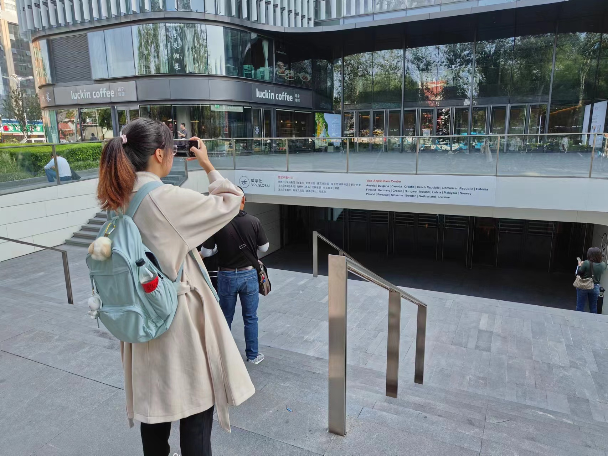
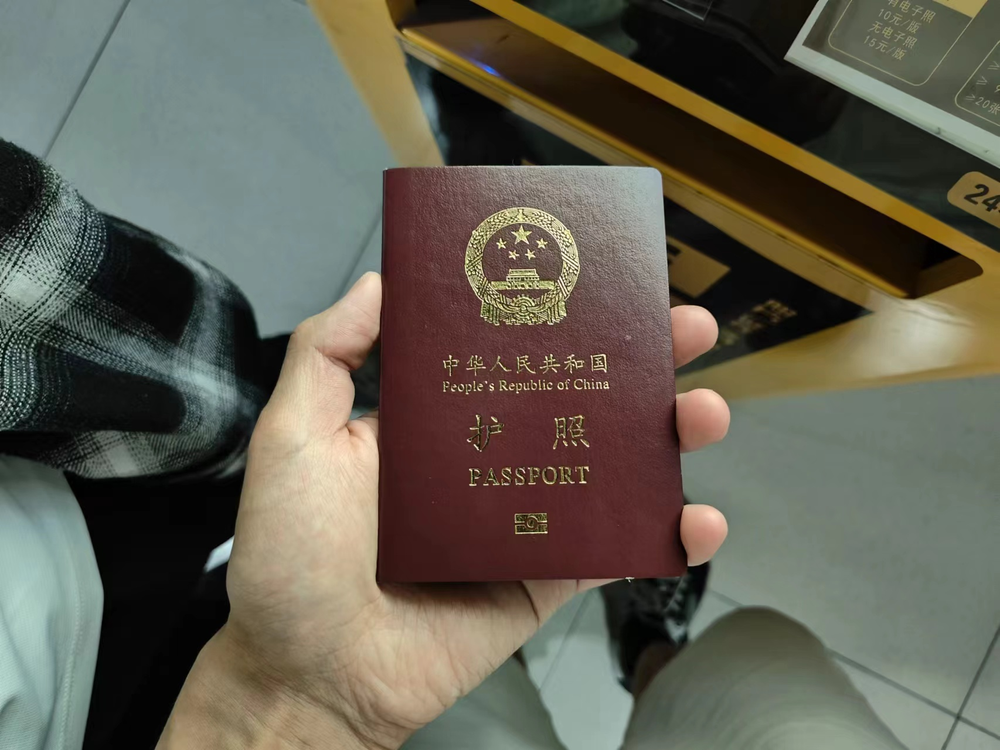
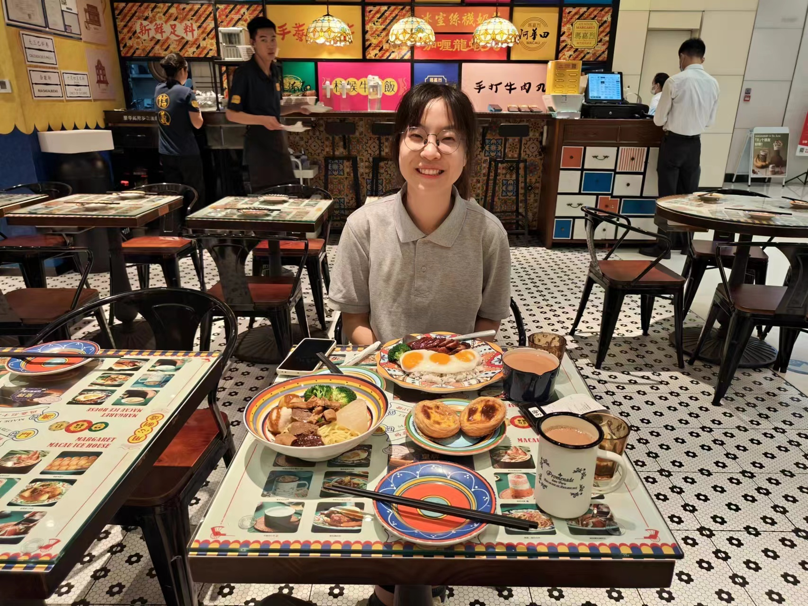

之前有过个人主页，但是一直没有弄好，更没有更新。最近我将自己的 GitHub 的用户名改了，导致之前的 GitHub Pages 失效了，就趁机重新搭建个人主页。

兜兜转转，还是决定使用 Hexo。以前用过 Jekyll，觉得还行，但是真的不想用 Ruby，Hugo 又太麻烦。

<!-- more -->

选了好久主题，Hexo 宣传说有很多主题，但是官网上不到 400 个主题，而且大部分都不符合我的审美或者要求。我想要的风格是简约，现代，需要同时支持黑暗和白亮模式，需要有代码高亮且是代码是等款字体。最接近我的要求就是[Maple](https://www.github.com/xbmlz/hexo-theme-maple)主题。可是仍然无法满足我的要求，所以我修改了一些格式（原版甚至有一些颜色 bug），添加了自己的一些内容，结果是一个叫做[枫叶](https://www.github.com/chen-yingfa/hexo-theme-fengye)的主题。

## 日记

今天早上七点半起来 🛏，打电话 📱 叫醒00（终于有一次是我打电话了哈哈哈哈），然后去核研院俱乐部在综体打羽毛球 🏸，后来发现他们其实约了西体，但是我跟00自己在蹭一个空场就不管了，八点半左右有人来了我们就去过早，然后去我宿舍 🏡。

之后点了库迪，然后去了学校南边的一个超市，买了一大包薯片和一个榴莲！然后就在宿舍没有吃午饭，直接待到晚饭。中午的时候还拍了视频 📷，中间还差点说到00emo了，哈哈哈哈。

今天 00 下午四点和晚上七点都有直播课 👩🏻‍🏫，都是真正开课，下午的在我宿舍开的，好像很成功，虽然拖堂了一点点。晚上的在她自己宿舍，貌似也拖堂了，00 说有好多人。

晚上九点去打羽毛球了 🏸，带上相机录了打球的视频，然后回去洗澡，晚上去林大北路的家 🏡。

## 最近

最近好忙，新学期马上就要开始了，这里总结一下暑假开始到此比较重要的事情吧。

这个暑假搬出校又搬回来了，折腾了又费钱 💰，学校真的好恶心，之前说了大概率是不会有宿舍，现在就有很多空的房间。

期末前跟导师确定了要读博了，我跟他我想要三年毕业，他说没有问题，希望真的是可以吧，我们实验室好像基本都是直博生，普博的应该都是四年吧。00 也确定了不会读博了，最近在投简历，Oppo 好像已经拿到了 offer，但是他们北京没有部门，所以 00 不想去，我也不想她去。好像互联网以外很多公司都不在北京……

我的论文 📃 EREN（以前叫做 EmoRen）投出去了，上周 rebuttal 结果出来了，不是很理想，本来 soundess 是 433，Excitement 323，rebuttal 结束后第一个审稿人将 soundness 调低了。学长说主会议估计没有机会了，Findings 还有希望，我其实无所谓是不是 Findings，感觉学长反而有点介意。

被实验室的学长学姐拉去面壁智能[^2]去干活，跟公司的业务没啥关系，就是把我的工位搬了，可能不想占用隔壁实验室的位置吧 😂 但是我真的不想去 😭 不能跟 00 待在一起了。我现在就是一周可能去两三天 😂

[^2]:我导师和知乎孵化的的公司

最近还申请了签证，决定了寒假 00 跟我一起回家！在家待一整个月，好神奇，觉得我们的关系发展得好顺利。马上的国庆 🇨🇳 我会跟 00 回去武汉和应城参加她高中同学和表姐的婚礼 💑，顺便还会看她的外公外婆。

---

## 一些 Markdown 渲染器测试

测试一下公式的渲染。^[我现在用了 [hexo-rendered-markdown-it](https://github.com/hexojs/hexo-renderer-markdown-it) 来代替原来 Hexo 的渲染器。原来的渲染器是 Marked (hexo-renderer-marked)]

$$
\theta_i \leftarrow  \frac{\partial}{\partial  \theta_i} \mathcal L( y, f(x; \theta))
$$

其中 $\mathcal L$ 是损失函数，$f(\cdot; \theta)$ 由 $\theta$ 参数化的模型。

那 `代码` 呢？`codell1i0oO` 可以吗？

一个表格：

| Method | Accuracy |
| ------ | -------- |
| A      | 0.1      |
| B      | 0.2      |
| C      | 0.3      |

一个嵌套列表：

- a

  - x
  - asdf

    - 懂得都懂

  - 好好

    1. item 1
    2. item 2

       1. sdf
       2. sdf

    3. item 3

- asdf

一个代办列表：

- [ ] 买菜
- [ ] 做饭
- [x] 跑步
- [x] 打羽毛球
- [x] 写论文
- [ ] 搞科研

auto-links: [www.hexo.io](http://www.hexo.io)
