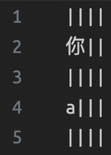

在 VS Code 中，中英混用的时候会发现字体没有对齐。VS Code 官方说法是，渲染字体的方式是 Chromium 决定的，所以他们无法解决这个问题，他们推荐我们自行找中文等宽的字体。网上最常见的说法是用叫做 [Sarasa-Gothic](https://github.com/be5invis/Sarasa-Gothic) 的字体（中文是「更纱黑体」）。可是这个字体不仅巨大，还有点丑，名字我也不喜欢。还好找到了一个更符合我要求的字体：[Ubuntu Mono](https://fonts.google.com/specimen/Ubuntu+Mono?preview.text=mmm&query=ubuntu+mono)。

<!-- more -->

它不仅符合我对字体的最低要求：

- 美观（这个很主观）
- 等宽
- 中英字符对齐
- 能很好地区分 `iIl1`, `oO0`, `:;.,`, `'"‘’“”` （指引号和弯引号）

还有其他优点：用 open-tail 的 g （看 Figure 1）。唯一的缺点就是 `m` 比较丑。




## 下载和使用

下载完之后，导入系统的字体目录。然后在 VS Code 的 settings 里面加上 

```json
{
    // ...
    "editor.fontFamily": "'Ubuntu Mono'",
    // ...
}
```

默认下中文字体应该会 fallback 到黑体，如果没有的话，你把 `'Ubuntu Mono'` 改成 `'Ubuntu Mono', 黑体` 就行。注意引号。
