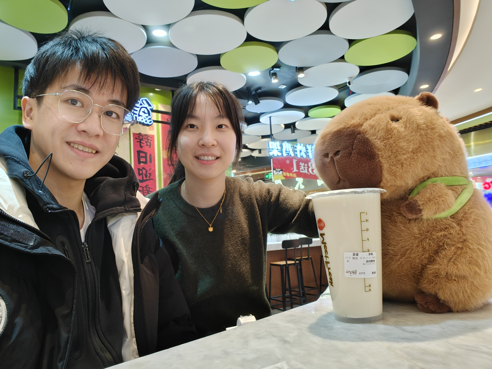
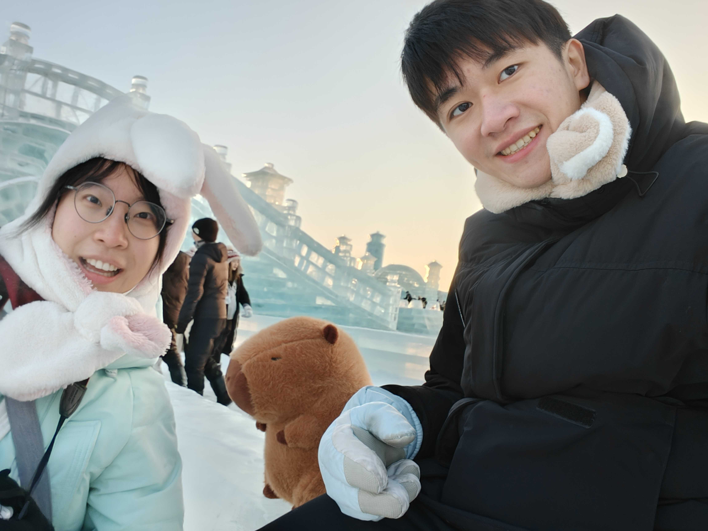
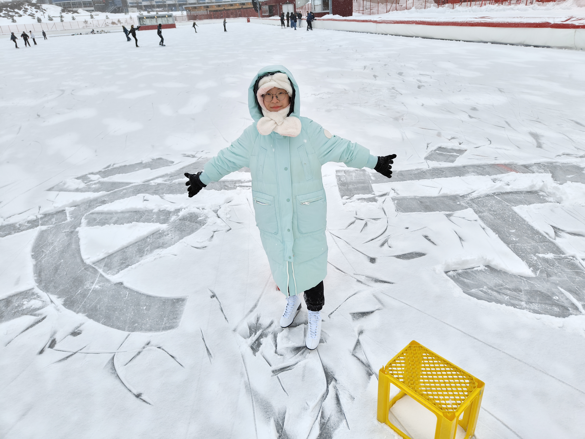
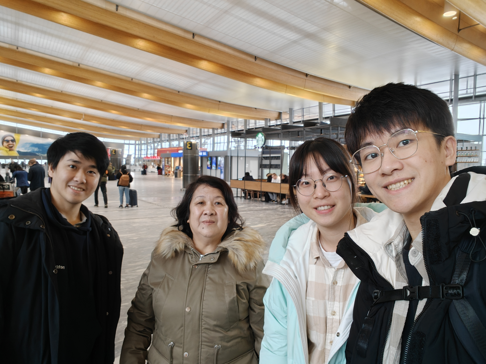
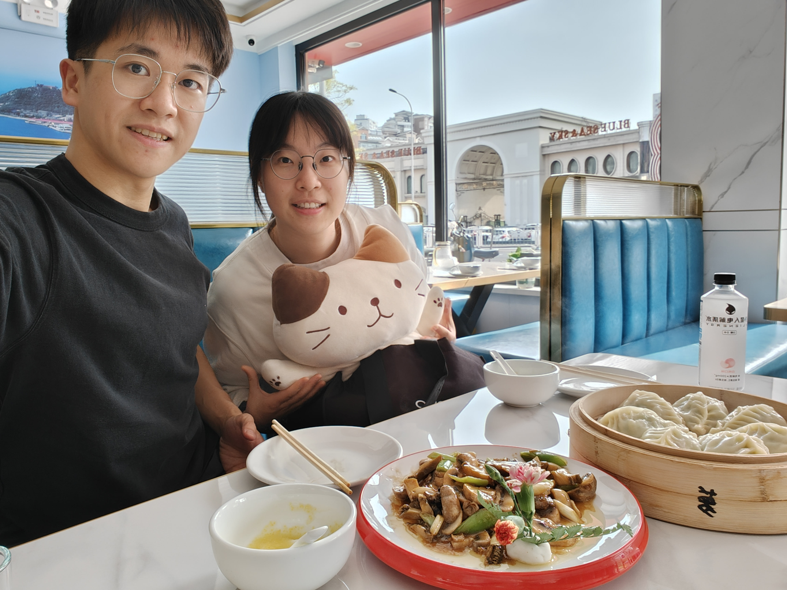
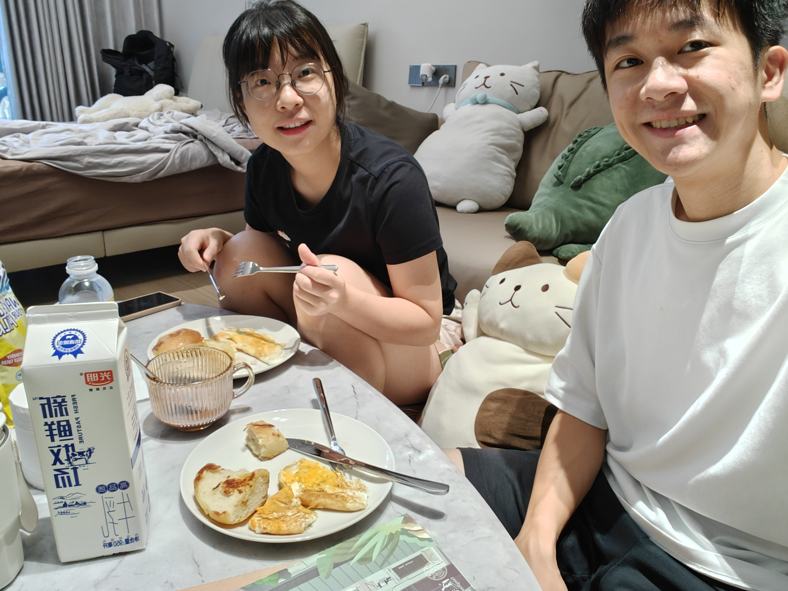

刚刚放完国庆假，从东莞回来了北京继续我的博士生涯。这几个月感觉事情特别多，虽然很充实，但也很累，刚好这个七天长假可以让我喘口气。很久没有写博客了，上一次关于我自己的博客内容好像就是去年国庆之后的。刚好过一年，也可以当作一个年度总结吧。

<!-- more -->

今年最主要的几件事情如下。

- 从硕士变成了博士。
- 女朋友毕业后，去了东莞工作，并且跟她一起建设了一个小家，也把娃基本都带过去了（现在我宿舍只剩下大白和两个猪）。
- 女朋友跟我一起回挪威见我的家长了，也是她第一次出国。
- 家人来了中国参加我的毕业典礼，顺便和女朋友家人见了面，定了亲。
- 当上了实验室里的研究小组组长，参与了公司的运行，很有打工人的感觉。
- 认识了很多做科研的人，对科研的认知进步了超级多，也看了超级多论文，找到了自己喜欢的小领域，感觉得心应手，idea 也超级多。
- 当上了 NLP 课的助教，是一个很有意思的体验。

## 科研篇

去年暑假被一位学姐拉到导师公司坐着，因为环境好又有钱，然后后面就顺理成章跟她一起做了科研项目，进入了新的小组（刚好一直带我的学长也快要毕业了）。后面，好像是五月份左右，这边的小组组长因为要出去实习，让我当上了组长，感觉非常不一样，一开始压力还挺大的，也觉得自己能力不够，德不配位。但是其实还行，大家也都是为了做科研而已，就是多了很多跟别的组拉扯的情况。同时，来到这边之后找到了自己的新方向了：RNN 和长文本。特别喜欢这种，有点小众，同时还影响力挺大的研究方向，就是一开始看论文有点吃力，毕竟很多基础理论跟现在火热的 Transformer 有比较大的出入，研究难点也很不一样。但是这样才好，同行少一点，看论文的压力也少一点（顺便吐槽一下，现在论文真的太多了，每次放完假都觉得错过了无数篇论文！）。另外，这段时间也把楚简论文投了 ARR，评分不是很好最近就改投 COLING 了。同时也挂了 arXiv，但是这种工作感觉影响力就不是很大，虽然也是首个相关数据集，肯定能拿到一些引用的。感觉我数据集的工作还挺多的，哈哈哈哈哈。

前几天 10 月 2 日投了 ICLR，《Stuffed Mamba: State Collapse and State Capacity of RNN-Based Long-Context Modeling》，是我感觉比较满意的一个研究工作，做了也很久，感觉影响力应该会不错。然后今天凌晨两点把它放到 arXiv，争取一下靠前一点的位置。但是这篇工作只是开胃菜，是一个关于模型记忆能力的探索和一些崩溃现象的分析，后面还是得做实际的模型改动来提高模型性能，这才是我向往代表性工作，但是还是挺难的，虽然说 idea 很多，但是机器学习的研究就是一个反复试错的过程，大部分结果还是会跟猜想有很大的出入的。老师想要我训一个很强的 Mamba 版 MiniCPM，但是我觉得不做结构上的改动的这种训练没有什么科学贡献，个人还是希望做科学贡献，哈哈哈哈哈。

## 生活篇

之前最后一年跟 00 在学校每天都会见面，玩耍。 国庆结束后没多久我们就 10 月 27 日到 31 日一起去了东莞参观公司，感觉环境很不错，就是东莞这个城市很破旧，人均素质也挺低。没办法。29 日去了深圳玩，见了已经工作了的于泽华和 00 的堂姐。11 月 17 日，跟 00 去了孝感市的安陆市参加她高中同学，金洁，的婚礼，好羡慕人家可以这么早结婚。但是习俗确实好麻烦……后面 00 找了个实习，是【比特大陆】，在丰台区，中关村壹号对面，离我们实验室相关公司的【启元实验室】挺接近的。有时候我也会去启元上班，然后就可以一起下班了。

11 月 26 日，我们一起玩耍了一天，先是在新的体育馆里溜冰了，然后去了四道口的【汤泉良子】泡温泉，这里感觉挺舒服干净的，还有自助榴莲吃！12 月 13 日，学校下大雪了，我们一起堆雪人了！其实就是滚了一个大雪球，然后开始往对方身上扔雪球。12 月 24 日，我们再泡温泉了。之后就到元旦了，一起在朝阳区的蓝色港湾跨年了，人超级多，差点没有找到地方吃饭。最后在一个西餐厅找到了位置，味道还行，就是有点贵。然后在星巴克里坐到了 12 点，一起在二楼露台倒数。下一天我们去了【比特大陆】参加元旦的活动，有很多小游戏可以玩，还一起弄了一个灯笼和「流体蚂蚁」（其实就是把一个蚂蚁磨具，就是比特大陆的吉祥物，染上各种染料）。1 月 5 日晚上我们一起做绿皮车去哈尔滨，感觉这次去的地方都挺好玩的。天气是真的冷。然后还买了新的娃，一只猪（其实是卡皮巴拉）！

后面春节，00 跟我一起回去挪威见我的家人，还带了一些礼物（茶叶和一个狐狸玩偶）在我家里住一个月，住在我姐姐的房间里，这也是她首次出国，申请签证还得去了一趟三里屯，但是审核倒是很快通过。在我家里其实就是每天宅在家里，我这边不像 00 家里，不需要跟各种亲戚朋友社交，所以就是每天在家里跟 00 分享我的一些小时候的东西，比如跟我一起打 PS3，小时候的食物。然后做了很多面包，感觉特别好吃！！而且跟她一起做饭就挺好玩的。还有吃了很多 00 没有吃过的东西，比如一些做法的牛排、鹿肉、鲨鱼肉、一些鱼、披萨、羊奶芝士、苹果派、热狗、某种带米粒的酸奶（Rislunsj）。后面还 roadtrip 去了我老家 Lillesand，看到了我老家的房子、我的小学中学。后面还看到了我的一个初中和高中的同学 Naomi，发现很多人都离开了小镇，但是她说有一些人会回来当老师。另外，我、00 跟我兄弟姐妹还一起拼了三维拼图，做了茶颜悦色的奶茶，感觉很温馨，很有家的感觉。我们还一起坐船去了哥本哈根，感觉这个城市比奥斯陆更加适合旅游，历史气息也更多（历史也确实更加悠长）。后面 2 月 21 日回来北京了。

4 月 9 日的时候，我们一起去了天津玩，坐高铁非常快，可是，我们是自驾去的！00 刚拿的驾照就上高速，哈哈哈哈哈，中间有几次确实很刺激。天津感觉可玩性不是很高，而且很多地方其实也挺破的，当然还是比东莞好太多了。4 月 27 日我们带着猫咪一起去了大连、烟台和长岛。提前放的五一假期，吃了很多海鲜。这边感觉也是挺破的，但是有些地方感觉很新奇，而且也看到了沙滩。后面是坐船去烟台的，船上感觉其实还行，是自己的房间，但是在烟台没呆多久就直接坐船去长岛了。长岛上酒店是在景点里面的，但是特别破，甚至感觉有点不是很正规，里面也有不少虫子。外面的景色不错，但是属实有点无聊，我们就是各种拍照。

5 月 10 日 00 毕设答辩，我在后面听着，感觉 00 被老师们的问题难到了，但是其实感觉不难回答的，就是老师们比较笨，理解不了这些新技术。最后当然还是顺利的。5 月 24 日 00 回家了一趟，因为在学校没有事情干，我 25 日硕士毕设答辩，非常顺利，我老师感觉也不怎么管。后面直到暑假的时间就没有什么特殊的了，我还是照常上班，00 就每天在玩耍，每隔一段时间就会一起出去逛街吃饭。感觉这段时间 00 因为没有事情干，又开始经常 emo 了，觉得我不理她。结果就是我们逛街频率增加了，但是其实相比于其他情侣好像也不算很频繁。6 月 22 日和 23 日，跟 00 一起拍了毕业照，第一天是我们俩穿汉服自己拍照，第二天是约了她的一个本科师弟，一个会收钱拍毕业照的人。

暑假的时候，我们家人都来了参加毕业典礼，我们分别跟各自的家人在北京旅游了一段时间，然后她跟我家人一起去了日本大阪、奈良和京都旅行。感觉还挺好玩的，00 特别喜欢奈良的鹿。然后 7 月 12 号跟 00 一起坐飞机去了东莞，办理入职，找房子。最后租下来长安花园的房子，有点破旧，但是有小区。入住后发现有蟑螂，特别大（有些能到 5cm），还会飞！我跟 00 都从来没有见过，被吓蒙了。后面就是成天杀虫。但是因为我很快就走了，只能尽快买下基础家具。00 也经常吐槽我不陪她，感觉很无奈。

后面跟家人旅游一段时间后，八月一号左右就回去跟 00 待一会儿。然后回去北京干活。后面中秋回去了一次，那时候跟 00 一起搬家到新的 Oppo 工业园。然后就是这次国庆假期回去了。新工业园的居住环境比长安花园好太多了，果然新的房子就是好。而且还有各种舒适的配套设施，路干净、宽敞、平。楼下有理发店、便利店。两百米外有食堂和运动场所，包含羽毛球、乒乓球、健身房、台球室等等。后面还有瑞幸和 KFC 来开张。

生活也算是稳定下来了，突然觉得很有希望，而且感觉生活也挺美好的，钱也不少，如果不用担心买房根本花不完。我好好做科研后面收入也会很不错。希望将来的一年我能做出效率加倍，做出自己觉得有意义的科研，00 也可以继续快乐、阳光、向上！希望我们都活的精彩！
