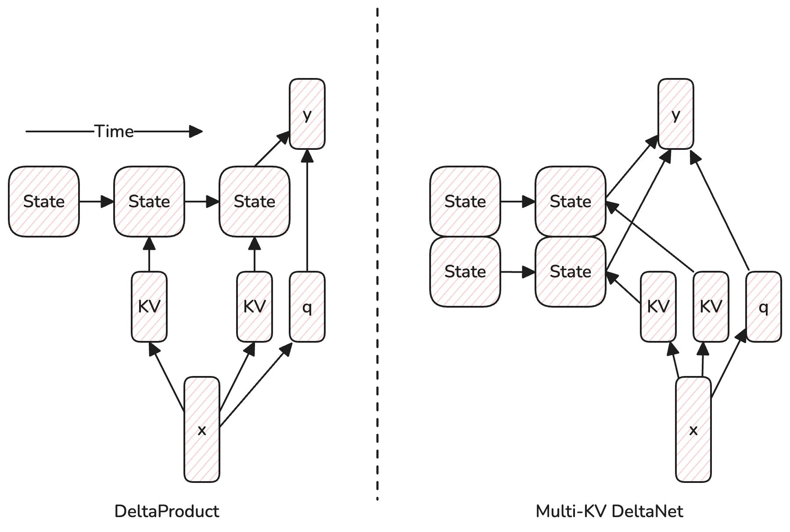

In DeltaProduct [(Siems et al., 2025)](https://arxiv.org/pdf/2502.10297), they propose to improve DeltaNet [(Yang et al., 2025)](https://arxiv.org/pdf/2412.06464) by updating the online memory with $n_h$ KVs for each token, which can be seen as performing multiple steps of gradient descent per token. I will explain how this method is almost the same as multi-KV DeltaNet and reveal a potential flaw in the design of DeltaProduct.


<!-- more -->

## Introduction

### DeltaNet

> We use row-vector notation.

The update rule and query rule of DeltaNet can be written as:

$$
\mathbf W_t = \mathbf W_{t-1} - \eta_t \frac{\ell(k_t, v_t, \mathbf W_{t-1})}{ \partial \mathbf W_{t-1} } \in \mathbb R ^{d \times d}
$$
$$
y_t = q_t \mathbf W_t \in \mathbb R ^d
$$

where $q_t, k_t, v_t\in\mathbb R^{d}$ are the query, key, and value vectors at time $t$, respectively, $\mathbf W_t$ is the recurrent state *and* the parameters of an online learner. $d$ is a hyperparameter. The function $\ell$ is the loss function.

$$
\ell(k_t,v_t,\mathbf W_{t-1}) = \frac 1 2 \Vert k_t \mathbf W_{t-1} - v_t \Vert ^2_2 \\\\
\Rightarrow \frac{\partial \ell}{\partial \mathbf W_{t-1}} = k_t ^T(k_t \mathbf W_{t-1} - v_t)
$$

This gives us the update rule:
$$
\mathbf W_t = (\mathbf I - \eta_t k_t^Tk_t)\mathbf W_{t-1} + \eta_t k_t ^T v_t
$$

### DeltaProduct

DeltaProduct extends DeltaNet by generating $n_h$ KVs $(k_{t,i}, v_{t,i})$ and online learning rates $\eta_{t,i}$ for each token. The update rule becomes $\mathbf W_t = \mathbf A_t \mathbf W_{t-1} + \mathbf B_t$ where

$$
\mathbf A_t = \prod_{i=1}^{n_h}\left(\mathbf I-\eta_{t,i}k_{t,i}^Tk_{t,i} \right) 
$$
$$
\mathbf B_t = \sum_{i=1}^{n_h} \left( \sum_{j = i+1}^{n_h} \eta_{t,i} k_{t,i}^T v_{t,i} \right) \eta_{t,i} k_{t,i}^T v_{t,i}
$$

## Equivalence to Variants of Multi-Head DeltaNet

Since we are generating $n_h$ KVs for every token, this is similar to a multi-head mechanism that is commonly used in attention layers. The formulation of a **Multi-head DeltaNet** is as follows:

$$
y_t = \sum_{i=1}^{n_h} q_t \mathbf W_{t,i}
$$
$$
\mathbf W_{t,i} = (\mathbf I-\eta_{t,i} k_{t,i}^Tk_{t,i})\mathbf W_{t-1,i} + \eta_{t,i} k_{t,i} ^T v_{t,i}
$$

In DeltaProduct, there is only one query. So DeltaProduct is more similar to a version of multi-head DeltaNet where the query is shared among the heads, namely, the **Multi-KV DeltaNet**.

This is still not exactly the same as DeltaProduct, because in DeltaProduct, different KVs are inserted into the same state (in a sequential manner), while in multi-head DeltaNet, different KVs are inserted into different heads. In other words, different heads in DeltaProduct share *both the query and the state*. The following table summarizes the differences:

| Model                | Queries | Keys  | Values | State $(\mathbf W)$ |
| -------------------- | ------- | ----- | ------ | ------------------- |
| DeltaNet             | 1       | 1     | 1      | 1                   |
| DeltaProduct         | 1       | $n_h$ | $n_h$  | 1                   |
| Multi-head DeltaNet  | $n_h$   | $n_h$ | $n_h$  | $n_h$               |
| Multi-KV DeltaNet    | 1       | $n_h$ | $n_h$  | $n_h$               |
| Multi-value DeltaNet | 1       | 1     | $n_h$  | $n_h$               |
| Multi-key DeltaNet   | 1       | $n_h$ | 1      | $n_h$               |
| Multi-query DeltaNet | $n_h$   | 1     | 1      | 1                   |

To better illustrate the difference, I have drawn a diagram below:



## The Potential Flaw in DeltaProduct

Many works have shown that recurrent architecture are bottlenecked by the state size. Hence, I think it is unreasonable to try to insert multiple KVs into the same state. So one potential improvement to DeltaProduct is to use untied states (i.e., different states for different KVs), which turns it into a multi-KV DeltaNet. Inspired by Mamba2, maybe it's even better to use multi-value DeltaNet, which saves some parameters, thereby increasing the state to parameter size ratio.


## How to Cite

```bibtex
@misc{chen2025delta-product,
  author = {Yingfa Chen},
  title = {Multi-Head DeltaNet},
  year = {2025},
  url = {https://chen-yingfa.github.io/2025/03/22/2025-about-delta-product/},
}
```

Feel free to contact me if you want to discuss this further.

