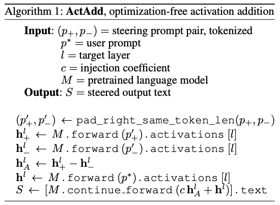
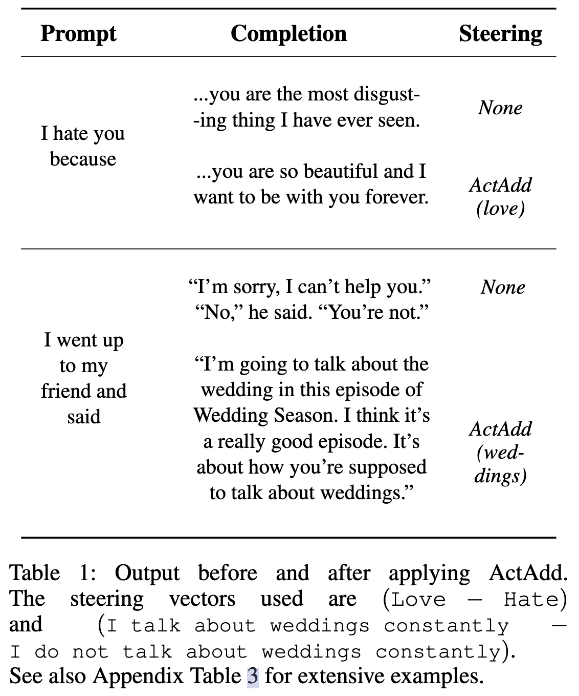

[Paper](https://arxiv.org/abs/2308.10248)

TLDR: Propose **ActAdd**, a method for controlling model behavior during inference by modifying activations with a bias term that is learned from a pair of prompt.

<!-- more -->

Summary:

- Propose **ActAdd**, a method for controlling model behavior by modifying activations at inference time.
- Steering vectors are computed by taking the activation differences that result from pairs of prompts. The vectors are added as bias during inference.
- ActAdd provides control over high-level properties of the output, and preserves off-target model performance, and requires little computational and implementational costs.

> The recently popular [representation engineering paper](https://arxiv.org/abs/2310.01405) (RepE) seems to be largely inspired by this work.

## Background

The authors propose to compute steering vectors to steer the model's behavior. They call such methods *activation engineering*. They make the following contributions:

- Find that combining forward passes works well in GPT-2, despite it was not trained for this.
- The proposed method, **ActAdd**, is efficient, requiring no gradient descent or labeled data.

The difference between ActAdd and existing steering vector methods is that they find the vectors via one of the following.

- Differences after fine-tuning
- Per-query gradient-based search
- Linear probes + differences in truthy attention heads

In contrast, ActAdd uses the difference between prompt pairs instead.

## Method

The method is really, really simple. Simply manually contruct a pair of prompts, and compute the difference between the activations. Then, add the difference as a bias term to the activations during inference. The algorithm is as follows.

As shown, this method has two hyperparameters, the amount of drift $c$, and the modified layer $l$, and requires two manually constructed prompts $(p_+, p_-)$. How to more effectively construct these prompts is not discussed in this paper.

## Result

## My Thoughts

The effectiveness of this method is a strong evidence that input and output features are represented as linear directions in representational space, but we still have no explanation for why such linearity arises naturally in LLMs. The fact that this actually works is very thought-provoking. However, ActAdd start to see degraded performance on off-target inputs when we drive the activations to far off, and the steering sometimes simply fails, this may indicate that the optimal steering path is not linear, which I believe is reasonable. This is somewhat similar to neuron attribution methods, many features/skills/knowledge cannot be attributed to single neurons (they are distributed across neurons), but existing neuron attribution methods still work well because, by change, some features are primarily determined by the activity or state of a single neuron (or a small set of neurons).

We can also draw a parallel with [BitFit](https://arxiv.org/abs/2106.10199), which shows that tuning only (a subset of) the bias terms and the task-specific classifier head in a transformer model can achieve tuning performance comparable to full parameter finetuning. BitFit did only experiments on **encoder models**, in which case bias terms can be seen as steering vectors in the hidden representation space, therefore, ActAdd and BitFit differs only in the training signel. ActAdd uses the difference between the representation of a pair of (positive and negative) prompts, while BitFit propagates the human annotation from the classification head. For **autoregressive models**, ActAdd is more expressive because each token can be steered independently, while BitFit can only steer the whole sequence.

Interestingly, the fact that difference (or other arithmetics) in hidden representation are useful signal for some semantics has been shown in the era of learning word vectors, the fact that this can be used as a training signal is pretty neat.

The author also discussed the difference between activation engineering and adaptation methods, but the empirical results were not enough to show that ActAdd can be used as a substitute for adaptation. E.g., we cannot practically adapt the model into performing machine translation with ActAdd, because there is no negative prompt for translation. But perhaps upcoming works can apply this method to replace fine-tuning (or other adaptation methods). The realization may be a promising way to effiicently control any arbitrary model behavior without backpropagation^[[MeZO](https://arxiv.org/abs/2305.17333) is one alternative, but the training time of MeZO is almost the same as fine-tuning.].

Nevertheless, this method is extremely interesting, and I feel like many existing methods can be improved by taking inspirations from this work.
