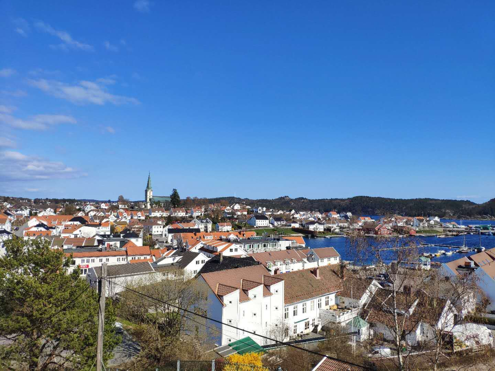
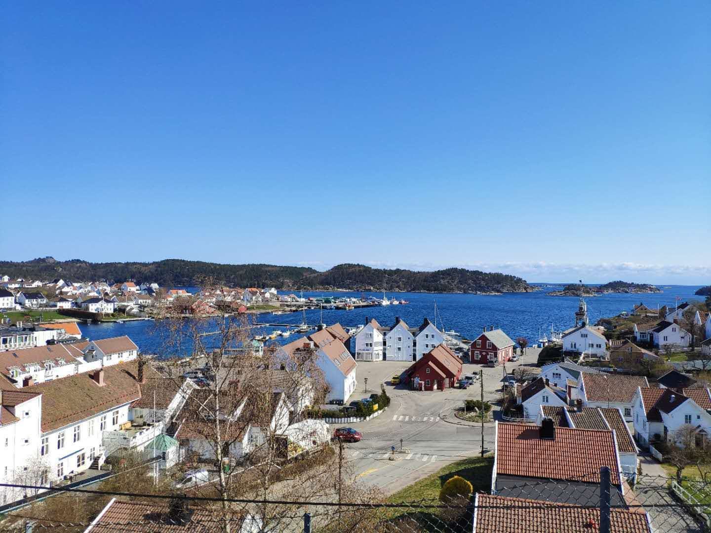

现在是 2023 年五月十七，马上硕士一年级就结束，在清华园已经快五年了，感觉对我人生的影响真的巨大。这一年认识了很可爱的 00，希望可以一直走下去。

我和 00 的孩子们：

<!-- more -->

- 卧龙：调皮的肥猫 🐱
- 小绿：喜欢咬东西的鳄鱼 🐊
- 骆雁：超级大的土鸡！🐰
- 凤雏：不调皮的猫咪 🐱
- 黄帝：更大的巨兔 🐰
- 内存条：白色的熊熊 🐻
- 闪光灯：灰色的熊熊 🐻

## 现在要做的事情

- 把 EmoRen 投了
  - 能不能行啊
- 跑 CFD 的丹炉调好
  - 好难呀
- 写完作业
  - NLP和DL的大作业！
- 搞定去ACL的手续
  - 去加拿大，然后回挪威一两周，然后回来跟 00 去南京，我不用签证，但是还是有很多手续。
- 写好开题报告
  - 还不知道做啥呢

## 我的家乡 Lillesand

好久没有回去了，上一次回挪威也没有回去