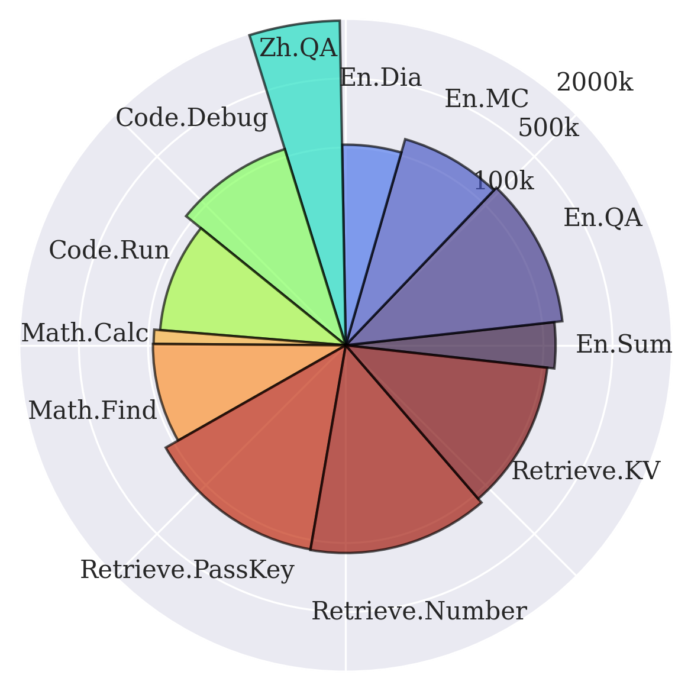
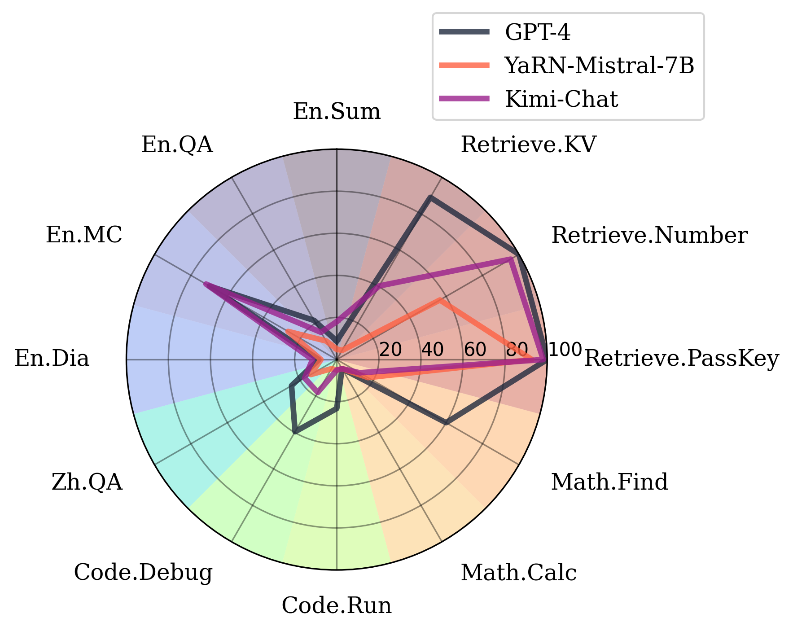

[Code](http://www.github.com/OpenBMB/InfiniteBench) | [Paper](upcoming)

The first benchmark for evaluating the effectiveness of LLMs in handling more than 100k tokens!

> In the paper, we name it $\infty$-Bench, but I will sometimes use "InfiniteBench" in this blog post for better readability.

Finally got some time to write this blog, been so busy lately! I have been in a fairly long duration of research hiatus, meanwhile the field of NLP has been revolutionized by an overwhelming number of new LLMs. Finally, I was able to arrive at some productive and meaningful work in this new era of research, as a second author. In this blog post, I will introduce this work that I have been working on recently.

<!-- more -->

## Background

The advent of LLMs have shown many promising results, but many practice applications (e.g., agents, document/webpage reading, long text summarization, etc.) are greatly limited by the context length constraint. Therefore, many works have strived to increase the length of the context that LLMs can accept. However, current "long-sequence" benchmarks all fall below 100k tokens, and is therefore not able to evaluate the effectiveness of many long-context LLMs. Our work, $\infty$-Bench

## The Data

The data consists of language tasks from diverse domains (math, code, novels), two languages (English and Chinese). Half of the tasks are automatically generated, which is desirable for optionally further scaling the context lengths to any arbitrary lengths.

Following shows the statistics of the tasks in our benchmark.

## Results

We tested SOTA proprietary and open-source LLMs at the time of evaluation. The result is shown below. We can see that in most tasks, the performance is far from satisfactory in practical applications.

## Thoughts on the Future of Long-Context Research

Our lab have been investing much efforts in long-context LLMs lately. Particularly, we are interested in developing LLMs that can accept infinite input lengths, or what some of my colleagues call streaming language models (i.e., models that operate on streaming inputs). I believe that the transformer architecture is inherently incapable of processing infinite-length inputs. This is the research direction that I have been focusing on.

### Inherent Limitations of Transformers

The most obvious reason is the quadratic complexity. A large number of research papers have focused on reducing the computational cost of the self-attention mechanism. But most SOTA LLMs at the moment are still dense attention layers, and rely on using Flash-Attention to speedup the computation. However, through discussion with various researchers, I have found that many people now believe that the attention computation is fast enough for most practical applications. I strongly disagree with this view. Firstly, the computational cost translates to the operational cost and emission that results from the usage of LLMs, which is of great concern. Secondly, my experience with ChatGPT (especially when using GPT-4) is that it is often not fast enough. Especially when it tends to produce many irrelevant lead-up sentences, I often find that I can find the answer using search engines before ChatGPT gives me the answer. Thirdly, current LLMs typically only have less than 100k in context length, however, as we apply them on contexts with millions of tokens, the speed of processing these tokens becomes unacceptable in most applications. For instance, in our experiments with InfiniteBench, applying a 7B model on 128k tokens using one A100 GPU takes 8~11 minutes to simply read the input^[I know that this is much faster than humans, but we expect AI to be faster than humans, especially considering they cost so much power to run.]. 

> This is not the only drawback of the transformer architecture, but that is out of the scope of this discussion.

### Possible Paths

I do not believe making small tweaks to the self-attention mechanism will solve the problem. Yep, we need new model architectures. Two architectures that I find promising are **linear attention** and **state-space models**. Since these architectures have been widely discussed in the research community, I will not describe them in detail here. Instead, I want to express my opinion on the future of these architectures.

I like to think of different language model architectures from the perspective of compressing the history^[This perspective is not new and has been discussed in many papers.]. The way transformers work is that they feed the last $L$ tokens without any compression to the model in each step. This means that the model remembers everything perfectly up to $L$ previous tokens, and remembers **nothing** about the history before that.

In contrast, state-space models and models with linear attention can learn to automatically choose what information retain about the past, which more closely resembles how humans memorize, and provides a smoother curve of forgettance (which is likely beneficial because a blurry remembrance is much better than complete forgettal). I firmly believe that this is the right direction to go. We are very likely to see a surge of LLMs with $O(1)$ inference cost in the upcoming five years, and this can drastically reduce the computational costs and increase their applicability in real-world applications.

Another thing to note is that, I have noticed that people like to align the parameter count of different LLMs during comparison, but for models with different architecture, this is a bad practice. In practice, we likely care more about the cost of maintenance, the speed of inference or training, and memory usage, etc. For instance, RetNet's training throughput is actually faster than a transformer with Flash-Attention. Imagine how fast RetNet + Flash-Attention can be. For applications, if a model is 10x faster than ChatGPT, but just slightly underperforms it, it is very likely that I will choose that over ChatGPT.

## Additional Notes

I am currently working on a linear attention model, but the field is changing so fast. I expect that this project will end within the next three months, because if not, my ideas will likely become obselete due to new works being released. Stay tuned.
